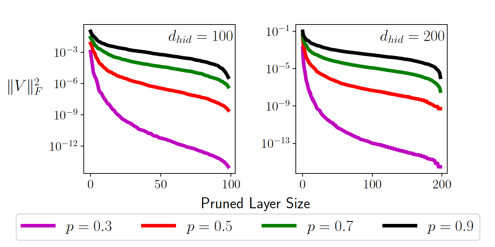

# i-SpaSP: Structured Neural Pruning via Sparse Signal Recovery
[](https://arxiv.org/abs/2112.04905)
&nbsp;

This is a public code repository for the publication:
> [**i-SpaSP: Structured Neural Pruning via Sparse Signal Recovery**](https://arxiv.org/abs/2112.04905)<br>
> Cameron R Wolfe, Anastasios Kyrillidis<br>

## Description



We propose a novel, structured pruning algorithm for neural networks---the iterative, Sparse Structured Pruning algorithm, dubbed as i-SpaSP.
Inspired by ideas from sparse signal recovery, i-SpaSP operates by iteratively identifying a larger set of important parameter groups (e.g., filters or neurons) within a network that contribute most to the residual between pruned and dense network output, then thresholding these groups based on a smaller, pre-defined pruning ratio.
For both two-layer and multi-layer network architectures with ReLU activations, we show the error induced by pruning with i-SpaSP decays polynomially, where the degree of this polynomial becomes arbitrarily large based on the sparsity of the dense network's hidden representations.
In our experiments, i-SpaSP is evaluated across a variety of datasets (i.e., MNIST and ImageNet) and architectures (i.e., feed forward networks, ResNet34, and MobileNetV2), where it is shown to discover high-performing sub-networks and improve upon the pruning efficiency of provable baseline methodologies by several orders of magnitude.
Put simply, i-SpaSP is easy to implement with automatic differentiation, achieves strong empirical results, comes with theoretical convergence guarantees, and is efficient, thus distinguishing itself as one of the few computationally efficient, practical, and provable pruning algorithms.

## Environment/Dependencies

Requires anaconda to be installed (python3)
Anaconda can be installed at https://www.anaconda.com/products/individual

```bash
conda create -n ispasp python=3.6 anaconda
conda activate ispasp
conda install pytorch torchvision torchaudio cudatoolkit=11.3 -c pytorch
pip install -r requirements.txt
```

## File Arrangement

Here we summarize all files present in this repo and their purpose.
```
+-- prune_resnet34_ispasp.py : i-SpaSP implementation for ResNet34
+-- prune_mobilenetv2_ispasp.py : i-SpaSP implementation for MobileNetV2
+-- lib/ : utility/helper functions
|   +-- data.py: helper functions for handling data
|   +-- utils.py: helper functions for computing performance metrics
+-- scripts/ : contains python scripts for running pruning experiments
|   +-- prune_rn34_ispasp.py: run an i-SpaSP pruning experiment for ResNet34  
|   +-- prune_mbnv2_ispasp.py: run an i-SpaSP pruning experiment for MobileNetV2
+-- requirements.txt : dependencies for pruning experiments
```

## Citing us
If you find this work useful, please cite our paper.
```
@article{wolfe2021spasp,
  title={i-SpaSP: Structured Neural Pruning via Sparse Signal Recovery},
  author={Wolfe, Cameron R and Kyrillidis, Anastasios},
  journal={arXiv preprint arXiv:2112.04905},
  year={2021}
}
```
